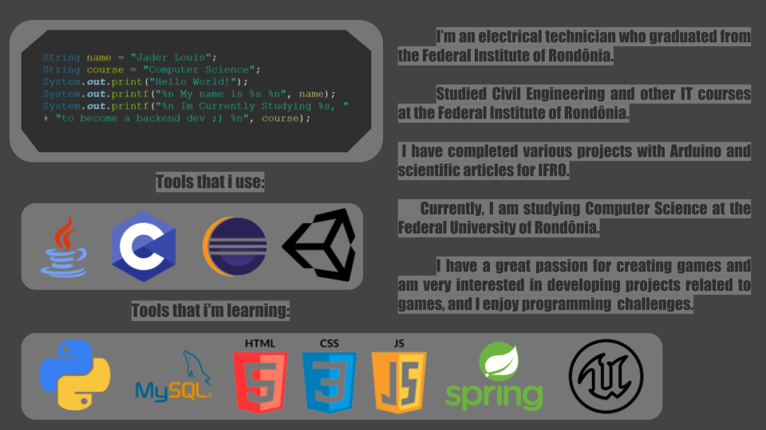

# 🤔 Who am i?
ℍ𝕖𝕝𝕝𝕠, 𝕞𝕪 𝕟𝕒𝕞𝕖 𝕚𝕤 𝕁á𝕕𝕖𝕣 𝕃𝕠𝕦𝕚𝕤, 𝕒𝕟𝕕 𝕀'𝕞 𝕔𝕦𝕣𝕣𝕖𝕟𝕥𝕝𝕪 𝕖𝕟𝕣𝕠𝕝𝕝𝕖𝕕 𝕚𝕟 𝕥𝕙𝕖 ℂ𝕠𝕞𝕡𝕦𝕥𝕖𝕣 𝕊𝕔𝕚𝕖𝕟𝕔𝕖 𝕡𝕣𝕠𝕘𝕣𝕒𝕞 𝕒𝕥 𝕌ℕ𝕀ℝ. 𝕀 𝕙𝕒𝕧𝕖 𝕒 𝕘𝕖𝕟𝕦𝕚𝕟𝕖 𝕡𝕒𝕤𝕤𝕚𝕠𝕟 𝕗𝕠𝕣 𝕥𝕖𝕔𝕙𝕟𝕠𝕝𝕠𝕘𝕪 𝕒𝕟𝕕 𝕚𝕥𝕤 𝕒𝕡𝕡𝕝𝕚𝕔𝕒𝕥𝕚𝕠𝕟𝕤. 𝕎𝕙𝕖𝕟 𝕀'𝕞 𝕟𝕠𝕥 𝕤𝕥𝕦𝕕𝕪𝕚𝕟𝕘 𝕠𝕣 𝕨𝕠𝕣𝕜𝕚𝕟𝕘 𝕠𝕟 𝕔𝕠𝕕𝕚𝕟𝕘 𝕡𝕣𝕠𝕛𝕖𝕔𝕥𝕤, 𝕪𝕠𝕦'𝕝𝕝 𝕠𝕗𝕥𝕖𝕟 𝕗𝕚𝕟𝕕 𝕞𝕖 𝕚𝕞𝕞𝕖𝕣𝕤𝕖𝕕 𝕚𝕟 𝕥𝕙𝕖 𝕨𝕠𝕣𝕝𝕕 𝕠𝕗 𝔽𝕠𝕣𝕞𝕦𝕝𝕒 𝟙, 𝕗𝕠𝕝𝕝𝕠𝕨𝕚𝕟𝕘 𝕣𝕒𝕔𝕖𝕤, 𝕒𝕟𝕕 𝕔𝕙𝕖𝕖𝕣𝕚𝕟𝕘 𝕗𝕠𝕣 𝕞𝕪 𝕗𝕒𝕧𝕠𝕣𝕚𝕥𝕖 𝕕𝕣𝕚𝕧𝕖𝕣𝕤 𝕒𝕟𝕕 𝕥𝕖𝕒𝕞𝕤.𝔸𝕤𝕚𝕕𝕖 𝕗𝕣𝕠𝕞 𝕞𝕪 𝕚𝕟𝕥𝕖𝕣𝕖𝕤𝕥 𝕚𝕟 𝕞𝕠𝕥𝕠𝕣𝕤𝕡𝕠𝕣𝕥𝕤, 𝕀'𝕞 𝕒𝕟 𝕒𝕧𝕚𝕕 𝕘𝕒𝕞𝕖𝕣, 𝕒𝕟𝕕 𝕠𝕟𝕖 𝕠𝕗 𝕞𝕪 𝕘𝕠-𝕥𝕠 𝕘𝕒𝕞𝕖𝕤 𝕚𝕤 𝔻𝕠𝕥𝕒. 𝕀𝕥'𝕤 𝕟𝕠𝕥 𝕛𝕦𝕤𝕥 𝕒𝕓𝕠𝕦𝕥 𝕥𝕙𝕖 𝕔𝕠𝕞𝕡𝕖𝕥𝕚𝕥𝕚𝕠𝕟 𝕗𝕠𝕣 𝕞𝕖; 𝕚𝕥'𝕤 𝕒𝕝𝕤𝕠 𝕒𝕓𝕠𝕦𝕥 𝕥𝕙𝕖 𝕤𝕥𝕣𝕒𝕥𝕖𝕘𝕪 𝕒𝕟𝕕 𝕥𝕖𝕒𝕞𝕨𝕠𝕣𝕜 𝕥𝕙𝕒𝕥 𝕞𝕒𝕜𝕖 𝕥𝕙𝕖𝕤𝕖 𝕘𝕒𝕞𝕖𝕤 𝕤𝕠 𝕔𝕒𝕡𝕥𝕚𝕧𝕒𝕥𝕚𝕟𝕘. 𝕀 𝕓𝕖𝕝𝕚𝕖𝕧𝕖 𝕥𝕙𝕖𝕪 𝕔𝕠𝕞𝕡𝕝𝕖𝕞𝕖𝕟𝕥 𝕞𝕪 𝕤𝕥𝕦𝕕𝕚𝕖𝕤 𝕚𝕟 𝕔𝕠𝕞𝕡𝕦𝕥𝕖𝕣 𝕤𝕔𝕚𝕖𝕟𝕔𝕖 𝕓𝕪 𝕖𝕟𝕙𝕒𝕟𝕔𝕚𝕟𝕘 𝕡𝕣𝕠𝕓𝕝𝕖𝕞-𝕤𝕠𝕝𝕧𝕚𝕟𝕘 𝕒𝕟𝕕 𝕔𝕣𝕚𝕥𝕚𝕔𝕒𝕝 𝕥𝕙𝕚𝕟𝕜𝕚𝕟𝕘 𝕤𝕜𝕚𝕝𝕝𝕤.𝕀'𝕞 𝕥𝕙𝕣𝕚𝕝𝕝𝕖𝕕 𝕥𝕠 𝕓𝕖 𝕒 𝕡𝕒𝕣𝕥 𝕠𝕗 𝕥𝕙𝕚𝕤 𝕔𝕠𝕞𝕞𝕦𝕟𝕚𝕥𝕪 𝕒𝕟𝕕 𝕝𝕠𝕠𝕜 𝕗𝕠𝕣𝕨𝕒𝕣𝕕 𝕥𝕠 𝕔𝕠𝕟𝕟𝕖𝕔𝕥𝕚𝕟𝕘 𝕨𝕚𝕥𝕙 𝕠𝕥𝕙𝕖𝕣𝕤 𝕨𝕙𝕠 𝕤𝕙𝕒𝕣𝕖 𝕤𝕚𝕞𝕚𝕝𝕒𝕣 𝕚𝕟𝕥𝕖𝕣𝕖𝕤𝕥𝕤 𝕠𝕣 𝕙𝕒𝕧𝕖 𝕖𝕩𝕔𝕚𝕥𝕚𝕟𝕘 𝕖𝕩𝕡𝕖𝕣𝕚𝕖𝕟𝕔𝕖𝕤 𝕥𝕠 𝕤𝕙𝕒𝕣𝕖.
# 🔭 What am i working on?
 𝕀'𝕞 𝕒𝕔𝕥𝕚𝕧𝕖𝕝𝕪 𝕖𝕟𝕘𝕒𝕘𝕖𝕕 𝕚𝕟 𝕧𝕒𝕣𝕚𝕠𝕦𝕤 𝕦𝕟𝕚𝕧𝕖𝕣𝕤𝕚𝕥𝕪 𝕡𝕣𝕠𝕛𝕖𝕔𝕥𝕤 𝕥𝕙𝕒𝕥 𝕙𝕒𝕧𝕖 𝕡𝕣𝕠𝕧𝕚𝕕𝕖𝕕 𝕞𝕖 𝕨𝕚𝕥𝕙 𝕧𝕒𝕝𝕦𝕒𝕓𝕝𝕖 𝕙𝕒𝕟𝕕𝕤-𝕠𝕟 𝕖𝕩𝕡𝕖𝕣𝕚𝕖𝕟𝕔𝕖 𝕚𝕟 𝕒 𝕨𝕚𝕕𝕖 𝕣𝕒𝕟𝕘𝕖 𝕠𝕗 𝕒𝕣𝕖𝕒𝕤. 𝕋𝕙𝕚𝕤 𝕚𝕟𝕔𝕝𝕦𝕕𝕖𝕤 𝕨𝕠𝕣𝕜𝕚𝕟𝕘 𝕨𝕚𝕥𝕙 𝕔𝕝𝕠𝕦𝕕 𝕤𝕖𝕣𝕧𝕖𝕣𝕤, 𝕗𝕣𝕠𝕟𝕥-𝕖𝕟𝕕 𝕒𝕟𝕕 𝕓𝕒𝕔𝕜-𝕖𝕟𝕕 𝕕𝕖𝕧𝕖𝕝𝕠𝕡𝕞𝕖𝕟𝕥, 𝕒𝕤 𝕨𝕖𝕝𝕝 𝕒𝕤 𝕓𝕦𝕚𝕝𝕕𝕚𝕟𝕘 𝕒𝕡𝕡𝕝𝕚𝕔𝕒𝕥𝕚𝕠𝕟𝕤 𝕗𝕠𝕣 𝕞𝕠𝕓𝕚𝕝𝕖, 𝕨𝕖𝕓, 𝕒𝕟𝕕 𝕕𝕖𝕤𝕜𝕥𝕠𝕡 𝕡𝕝𝕒𝕥𝕗𝕠𝕣𝕞𝕤. 𝔸𝕕𝕕𝕚𝕥𝕚𝕠𝕟𝕒𝕝𝕝𝕪, 𝕀'𝕧𝕖 𝕘𝕒𝕚𝕟𝕖𝕕 𝕖𝕩𝕡𝕖𝕣𝕥𝕚𝕤𝕖 𝕚𝕟 𝕚𝕞𝕒𝕘𝕖 𝕡𝕣𝕠𝕔𝕖𝕤𝕤𝕚𝕟𝕘, 𝕒𝕣𝕥𝕚𝕗𝕚𝕔𝕚𝕒𝕝 𝕚𝕟𝕥𝕖𝕝𝕝𝕚𝕘𝕖𝕟𝕔𝕖, 𝕒𝕟𝕕 𝕕𝕒𝕥𝕒𝕓𝕒𝕤𝕖 𝕞𝕒𝕟𝕒𝕘𝕖𝕞𝕖𝕟𝕥 𝕥𝕙𝕣𝕠𝕦𝕘𝕙 𝕞𝕪 𝕚𝕟𝕧𝕠𝕝𝕧𝕖𝕞𝕖𝕟𝕥 𝕚𝕟 𝕥𝕙𝕖𝕤𝕖 𝕡𝕣𝕠𝕛𝕖𝕔𝕥𝕤.𝕄𝕠𝕣𝕖𝕠𝕧𝕖𝕣, 𝕞𝕪 𝕡𝕒𝕤𝕤𝕚𝕠𝕟 𝕗𝕠𝕣 𝕘𝕒𝕞𝕖 𝕕𝕖𝕧𝕖𝕝𝕠𝕡𝕞𝕖𝕟𝕥 𝕣𝕦𝕟𝕤 𝕕𝕖𝕖𝕡, 𝕒𝕟𝕕 𝕀 𝕠𝕗𝕥𝕖𝕟 𝕗𝕚𝕟𝕕 𝕞𝕪𝕤𝕖𝕝𝕗 𝕖𝕟𝕘𝕣𝕠𝕤𝕤𝕖𝕕 𝕚𝕟 𝕡𝕣𝕠𝕛𝕖𝕔𝕥𝕤 𝕦𝕥𝕚𝕝𝕚𝕫𝕚𝕟𝕘 𝕌𝕟𝕚𝕥𝕪 𝕠𝕣 𝕌𝕟𝕣𝕖𝕒𝕝 𝔼𝕟𝕘𝕚𝕟𝕖, 𝕡𝕦𝕣𝕖𝕝𝕪 𝕗𝕠𝕣 𝕥𝕙𝕖 𝕛𝕠𝕪 𝕠𝕗 𝕦𝕟𝕝𝕖𝕒𝕤𝕙𝕚𝕟𝕘 𝕔𝕣𝕖𝕒𝕥𝕚𝕧𝕚𝕥𝕪.𝕄𝕪 𝕔𝕠𝕞𝕞𝕚𝕥𝕞𝕖𝕟𝕥 𝕖𝕩𝕥𝕖𝕟𝕕𝕤 𝕓𝕖𝕪𝕠𝕟𝕕 𝕒𝕔𝕒𝕕𝕖𝕞𝕚𝕔𝕤, 𝕒𝕤 𝕀'𝕞 𝕖𝕒𝕘𝕖𝕣 𝕥𝕠 𝕔𝕠𝕝𝕝𝕒𝕓𝕠𝕣𝕒𝕥𝕖 𝕒𝕟𝕕 𝕔𝕠𝕟𝕟𝕖𝕔𝕥 𝕨𝕚𝕥𝕙 𝕝𝕚𝕜𝕖-𝕞𝕚𝕟𝕕𝕖𝕕 𝕚𝕟𝕕𝕚𝕧𝕚𝕕𝕦𝕒𝕝𝕤 𝕨𝕙𝕠 𝕤𝕙𝕒𝕣𝕖 𝕚𝕟𝕥𝕖𝕣𝕖𝕤𝕥𝕤 𝕚𝕟 𝕥𝕖𝕔𝕙𝕟𝕠𝕝𝕠𝕘𝕪, 𝕘𝕒𝕞𝕚𝕟𝕘, 𝕒𝕟𝕕 𝕕𝕖𝕧𝕖𝕝𝕠𝕡𝕞𝕖𝕟𝕥. 𝕀 𝕗𝕚𝕣𝕞𝕝𝕪 𝕓𝕖𝕝𝕚𝕖𝕧𝕖 𝕥𝕙𝕒𝕥 𝕓𝕪 𝕖𝕩𝕔𝕙𝕒𝕟𝕘𝕚𝕟𝕘 𝕖𝕩𝕡𝕖𝕣𝕚𝕖𝕟𝕔𝕖𝕤 𝕒𝕟𝕕 𝕚𝕕𝕖𝕒𝕤, 𝕨𝕖 𝕔𝕒𝕟 𝕕𝕚𝕤𝕔𝕠𝕧𝕖𝕣 𝕖𝕩𝕔𝕚𝕥𝕚𝕟𝕘 𝕟𝕖𝕨 𝕠𝕡𝕡𝕠𝕣𝕥𝕦𝕟𝕚𝕥𝕚𝕖𝕤 𝕒𝕟𝕕 𝕕𝕣𝕚𝕧𝕖 𝕚𝕟𝕟𝕠𝕧𝕒𝕥𝕚𝕠𝕟.
# ⚡ Fun facts: 
- I genuinely enjoy programming challenges and have participated in various programming marathon contests, such as the SBC. It's something I take great pleasure in.
- One of the things that truly inspires me to create games is games like Dwarf Fortress, where a single developer achieved incredible feats. To me, it's a genuine masterpiece in the world of game development, and I consider them true heroes.
- My favorite programming language is JAVA; however, I take great pride in my ability to easily learn other languages.
- In terms of Formula 1, I'm a big fan of Ferrari, even though this team often brings me sadness!

