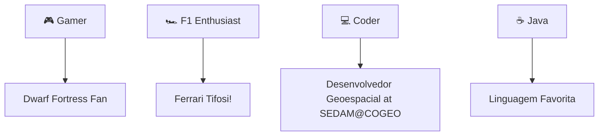

# 

<div align="center">
  
  [](https://github.com/prism411)
  [](https://github.com/prism411?tab=followers)
  [](https://github.com/prism411?tab=repositories)
  
</div>


## 🚀 Sobre Mim


```python
class JaderLouis:
    def __init__(self):
        self.nome = "Jáder Louis"
        self.formacao = "Ciência da Computação @ UNIR"
        self.localizacao = "Porto Velho, RO 🇧🇷"
        self.areas_interesse = [
            "Desenvolvimento Geoespacial",
            "Inteligência Artificial",
            "Processamento de Imagens",
            "Ciência de Dados",
            "Grafos",
            "LLMs"
        ]
        self.fun_fact = "Athlete & F1 Enthuasiast in my spare time"
    
    def status_atual(self):
        return "🔭 Trabalhando em projetos de IA e visão computacional"
```

<br clear="right"/>

## 💻 Tech Stack

<details open>
<summary><b>🎯 Linguagens Principais</b></summary>
<br>


</details>

<details>
<summary><b>🌐 Web Development</b></summary>
<br>


</details>

<details>
<summary><b>📱 Mobile & Game Development</b></summary>
<br>


</details>

<details>
<summary><b>🤖 AI & Machine Learning</b></summary>
<br>


</details>

<details>
<summary><b>🗄️ Databases & DevOps</b></summary>
<br>


</details>

## 📊 GitHub Analytics

<div align="center">
  
  
</div>

<div align="center">
  
</div>

## 🏆 Conquistas & Atividade

<div align="center">
  
  [](https://github.com/ryo-ma/github-profile-trophy)
  
</div>

<div align="center">
  
</div>

## 🎯 Projetos em Destaque

<div align="center">
  
| 🚀 Projeto | 📝 Descrição | 🔧 Stack | 📅 Última Atualização |
|------------|--------------|----------|------------------------|
| [**Ictiobiometria APP**](https://github.com/Ictio-Biometria) | Sistema de biometria para peixes | Flutter, Python, AI |  |
| [**JL-EyeTeractive**](https://github.com/Prism411/JL-EyeTeractive) | Interface interativa controlada por olhos | Computer Vision, Python |  |
| [**Visage Track Framework**](https://github.com/visagetrack-project) | Framework de rastreamento facial | OpenCV, TensorFlow |  |
| [**AlloCloud-OS**](https://github.com/AlloCloud-OS) | Sistema operacional em nuvem | Cloud, Distributed Systems |  |
| [**Jawyn Searcher**](https://github.com/jawyn-project) | Motor de busca inteligente | NLP, Search Algorithms |  |

</div>

## 🌟 Fun Facts

<div align="center">


```mermaid
graph TD
    A[🎮 Gamer] --> B[Dwarf Fortress Fan]
    C[🏎️ F1 Enthusiast] --> D[Ferrari Tifosi!]
    E[💻 Coder] --> F[Desenvolvedor Geoespacial at SEDAM@COGEO]
    G[☕ Java] --> H[Linguagem Favorita]
```

</div>

## 🤝 Vamos Conectar!

<div align="center">
  
  [](https://linkedin.com/in/jaderlouis)
  [](mailto:seu-email@exemplo.com)
  [](https://seu-portfolio.com)
  
</div>

---

<div align="center">
  
  ### 💭 Quote do Dia
  
  
  
  
  
  <sub>⭐ From [Jáder Louis](https://github.com/prism411) with 💙</sub>
  
</div>
